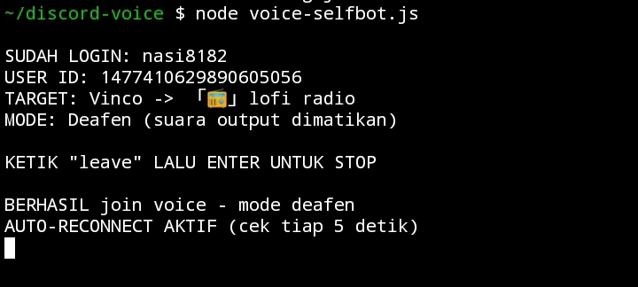

# Voice Selfbot Discord



Auto Join Voice Channel | Deafen Mode | Auto Reconnect | Lightweight

Support: Node.js 20+ | Termux | Linux | macOS | Windows


Peringatan Penting

Selfbot melanggar Term of Service Discord.


Fitur

- Auto join voice channel
- Deafen mode (mute output suara)
- Auto reconnect saat disconnect
- Deteksi koneksi internet (ping tiap 5 detik)
- Ringan (low CPU & RAM)
- Support Termux (Android)
- Support Linux / macOS / Windows
- Simpan konfigurasi ke file config.json
- Keluar dengan perintah "leave"


Persiapan

Dapatkan Token Discord

1. Buka Discord versi web (browser)
2. Tekan F12 buka DevTools
3. Buka tab Console / Konsol
4. Ketik kode berikut:

(webpackChunkdiscord_app.push([[''],{},e=>{m=[];for(let c in e.c)m.push(e.c[c])}]),m).find(m=>m?.exports?.default?.getToken!==undefined).exports.default.getToken()

5. Token akan muncul - JANGAN BAGIKAN KE SIAPA PUN

Dapatkan Guild ID dan Channel ID

1. Buka Discord
2. Settings -> Advanced -> Aktifkan Developer Mode
3. Klik kanan di nama server -> Copy ID (ini adalah Guild ID)
4. Klik kanan di voice channel -> Copy ID (ini adalah Channel ID)


Instalasi

Termux (Android)

pkg update && pkg upgrade -y
pkg install nodejs git -y
git clone https://github.com/nandaanomi/voice-selfbot-discord.git
cd voice-selfbot-discord
npm install
npm install discord.js-selfbot-v13@3.1.0 @discordjs/voice@0.16.0

Linux / macOS

sudo apt update && sudo apt install nodejs npm git -y
git clone https://github.com/nandaanomi/voice-selfbot-discord.git
cd voice-selfbot-discord
npm install
npm install discord.js-selfbot-v13@3.1.0 @discordjs/voice@0.16.0

Windows

1. Install Node.js dari https://nodejs.org (LTS version)
2. Install Git dari https://git-scm.com
3. Buka Command Prompt atau PowerShell

git clone https://github.com/nandaanomi/voice-selfbot-discord.git
cd voice-selfbot-discord
npm install
npm install discord.js-selfbot-v13@3.1.0 @discordjs/voice@0.16.0


Konfigurasi

nano config.json

Isi dengan format berikut:

{
  "token": "TOKEN_AKUN_DISCORD_KAMU",
  "guildId": "ID_SERVER_KAMU",
  "channelId": "ID_VOICE_CHANNEL_KAMU"
}

Simpan dengan Ctrl+X lalu Y lalu Enter.


Menjalankan

node voice-selfbot.js

Perintah

Ketik "leave" lalu enter untuk keluar dari voice channel dan mematikan bot.


Lisensi

MIT License
```bash

NANDA
```
<a href="https://saweria.co/NdasadPentester">
  
</a>
